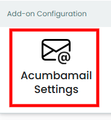
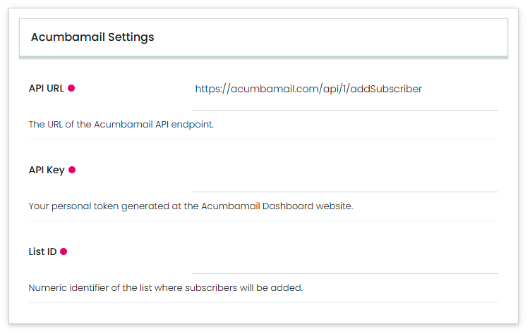

---
myst:
  html_meta:
    "description": "Acumbamail integration with Volto how-to guides"
    "property=og:description": "Acumbamail integration with Volto how-to guides"
    "property=og:title": "Acumbamail integration with Volto how-to guides"
    "keywords": "Acumbamail, service, Volto, integration, documentation, how-to, guides"
---

# General information

This part of the documentation contains how-to guides, including installation and usage.

## Features

- Control panel in {term}`Plone` registry to manage {term}`Acumbamail Settings`.

- RestApi endpoint that exposes the {term}`Acumbamail Settings` for {term}`Volto` _integration_.

- Add {term}`addSubscriber` endpoint support to new subscriber to the {term}`Acumbamail` list.

## Plone CMS integration

To use this product in {term}`Plone` CMS, you needs to include the following {term}`add-on` in your project: {term}`collective.volto.acumbamail`

## Translations

This product has been translated into

- Basque

- Catalan

- English

- Galician

- Spanish

## Compatibility

- Tested with Node.js 22.16.0 and {term}`Volto` 18.

## Install it

To install your project, you must choose the method appropriate to your version of {term}`Volto`.


### Volto 18 and later

Add `volto-acumbamail` to your `package.json`:

```json
"addons": [
    "volto-acumbamail": "*"
]
```

```json
"dependencies": {
    "volto-acumbamail": "*"
}
```

#### Install from Github

If you trying to install from Github you need edit the `mrs.developer.json` file:

```json
{
  "volto-acumbamail": {
    "develop": true,
    "output": "./packages/",
    "package": "volto-acumbamail",
    "url": "git@github.com:collective/volto-acumbamail.git",
    "https": "https://github.com/collective/volto-acumbamail.git",
    "branch": "main"
  }
}
```

The `mrs.developer.json` is using by an NodeJS utility called `mrs.developer` that makes
it easy to work with NPM projects containing lots of packages, of which you only want to
develop some.

Also add `volto-acumbamail` to your `package.json`:

```json
"addons": [
    "volto-acumbamail": "*"
]
```

```json
"dependencies": {
    "volto-acumbamail": "workspace:*",
}
```

---

### Volto 17 and earlier

Create a new Volto project (you can skip this step if you already have one):

```
npm install -g yo @plone/generator-volto
yo @plone/volto my-volto-project --addon volto-acumbamail
cd my-volto-project
```

Add `volto-acumbamail` to your package.json:

```json
"addons": [
    "volto-acumbamail"
],

"dependencies": {
    "volto-acumbamail": "*"
}
```

Download and install the new add-on by running:

```shell
yarn install
```

Start volto with:

```shell
yarn start
```

## Enable it

Go to the `Site setup`, next to the `Add-ons` control panel, find the {term}`collective.volto.acumbamail` add-on and click on the `Install` button.

Visit http://localhost:3000/ in a browser, login, enabled the {term}`add-on` and check the awesome new features.

## Settings it

To use this {term}`add-on`, go to the `Site setup`, next to the ``Add-on Configuration`` icon, as shown below:



This {term}`Acumbamail Settings`, you can access the control panel, as shown below:



In this control panel, you can configure the following fields:

- {term}`API URL`, The URL of the {term}`Acumbamail` API endpoint.

- {term}`API Key`, Your personal token generated at the {term}`Acumbamail` Dashboard website.

- {term}`List ID`, Numeric identifier of the list where subscribers will be added.

## Use it

To use the {term}`Acumbamail` integration you need add the {term}`volto-acumbamail` {term}`add-on`, in your {term}`Volto` project and
use the amazain features incluided.
